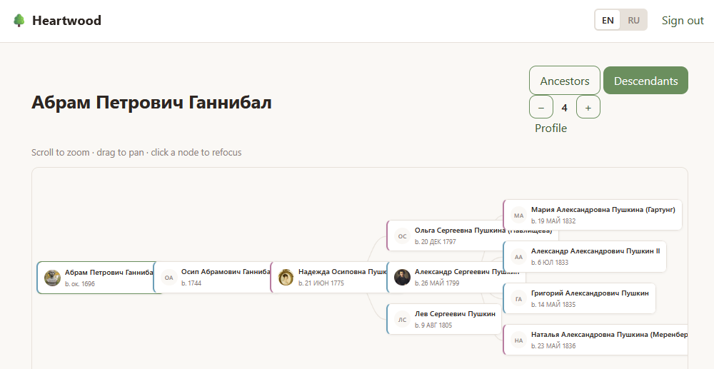
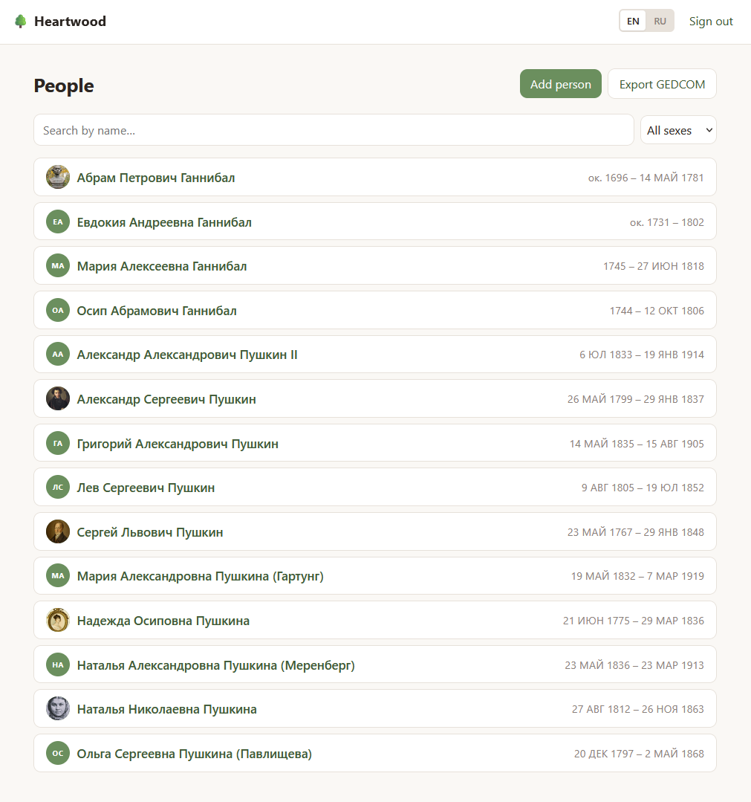
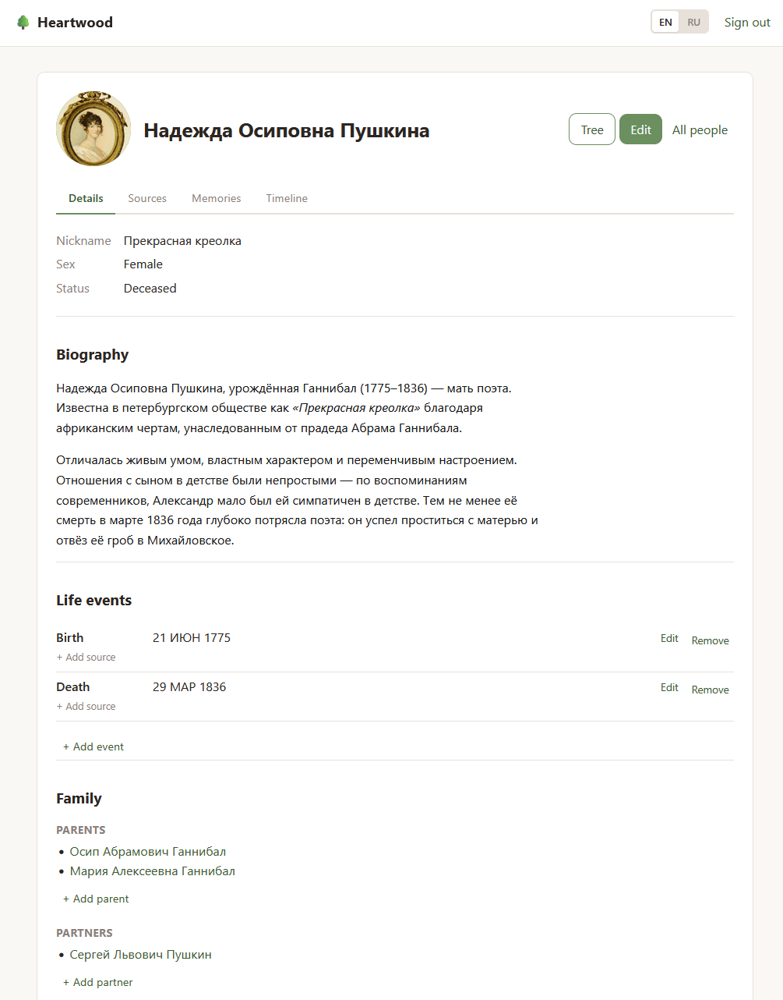
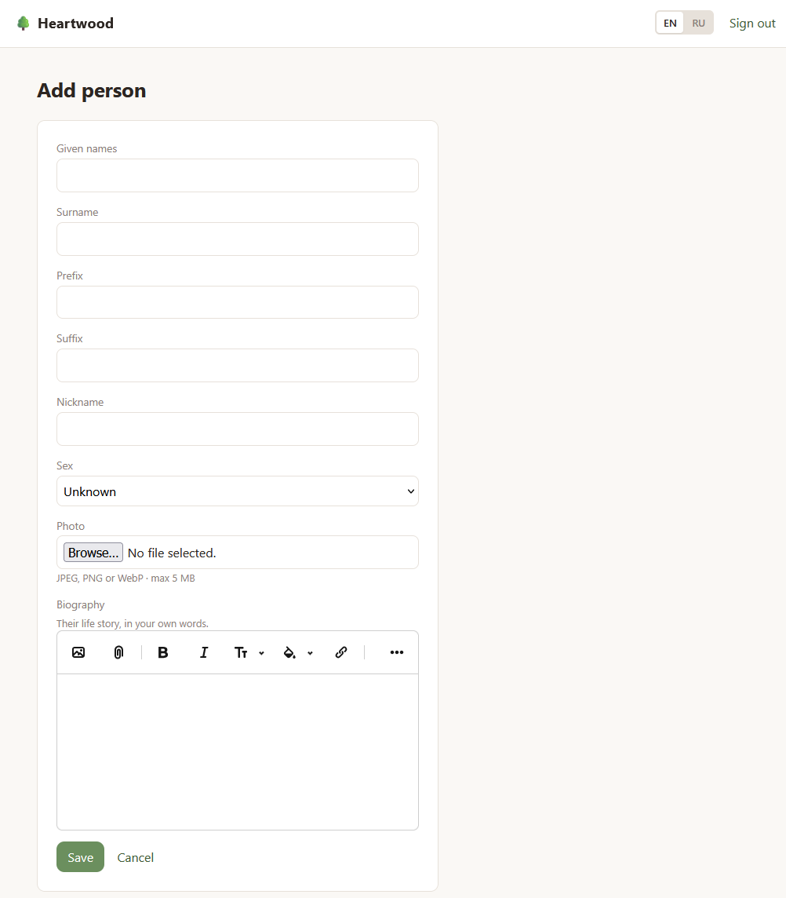

# Heartwood

> The living core of your family tree — open, yours, and built to last generations.

Heartwood is an open-source platform for building and preserving family trees. Run it
on your own server for free, forever — or let us host it for you for a small fee if you'd
rather just fill in your family's story and not think about servers.

The name is the dense, enduring core of a tree's trunk. That's the idea: an open **core**
you truly own, that outlives any single company or subscription.

## Screenshots

[](docs/screenshots/family-tree.png)

| People list | Person profile | Add person |
|:-----------:|:--------------:|:----------:|
| [](docs/screenshots/people-list.png) | [](docs/screenshots/person-profile.png) | [](docs/screenshots/add-person.png) |

## How Heartwood compares

The open-source genealogy space has powerful tools, but they were built in the PHP/desktop
era. The polished tools (Ancestry, MyHeritage) are closed and rent-seeking. **Heartwood
owns the unoccupied corner: modern UX + open + self-hostable + managed-optional, all at once.**

| Feature | **Heartwood** | webtrees | Gramps Web | GeneWeb | Ancestry |
|---|:---:|:---:|:---:|:---:|:---:|
| **Setup & Hosting** |
| Open source | ✅ AGPL | ✅ GPL | ✅ GPL | ✅ LGPL | ❌ |
| Self-hostable | ✅ | ✅ | ✅ | ✅ | ❌ |
| Managed hosting option | ✅ | ❌ | ❌ | ❌ | ✅ ($$$) |
| One-command deploy (Kamal) | ✅ | ❌ | ❌ | ❌ | — |
| SQLite in production — zero DB ops | ✅ | ❌ MySQL | ❌ | ❌ | — |
| No Node.js / no build step | ✅ | ✅ | ⚠️ | ✅ | — |
| **Core Genealogy** |
| GEDCOM import | ✅ | ✅ | ✅ | ✅ | ✅ |
| GEDCOM export — no lock-in | ✅ | ✅ | ✅ | ✅ | ⚠️ limited |
| Interactive tree view (pedigree / descendants) | ✅ | ✅ | ✅ | ⚠️ | ✅ |
| Person profiles with life events | ✅ | ✅ | ✅ | ✅ | ✅ |
| Sources & citations (evidence-first) | ✅ | ✅ | ✅ | ⚠️ | ✅ |
| Photo & media attachments | ✅ | ✅ | ✅ | ❌ | ✅ |
| Rich-text life story / biography | ✅ | ⚠️ notes | ⚠️ | ❌ | ✅ |
| Relationship calculator | 🔜 | ✅ | ✅ | ✅ | ✅ |
| **Collaboration** |
| Multi-user support | ✅ | ✅ | ✅ | ❌ | ✅ |
| Role-based access (owner / editor) | ✅ | ✅ | ⚠️ | ❌ | ✅ |
| Multiple trees per installation | ✅ | ✅ | ✅ | ⚠️ | ✅ |
| Living-person privacy (built into schema) | ✅ | ✅ | ✅ | ✅ | ⚠️ |
| **UX & Design** |
| Modern, responsive UI | ✅ | ⚠️ | ⚠️ | ❌ | ✅ |
| Inline editing — no page reloads | ✅ Hotwire | ⚠️ | ⚠️ | ❌ | ✅ |
| Timeline view | ✅ | ✅ | ✅ | ❌ | ✅ |
| Place maps | 🔜 | ✅ | ✅ | ❌ | ✅ |
| **Advanced** |
| Smart hints / duplicate matching | 🔜 | ❌ | ❌ | ❌ | ✅ ($$$) |
| DNA matching | 🔜 | ❌ | ❌ | ❌ | ✅ ($$$) |
| Free forever, no subscription | ✅ | ✅ | ✅ | ✅ | ❌ |

> ✅ Supported · ⚠️ Partial · ❌ Not available · 🔜 Planned · — Not applicable

## Philosophy

- **Own your roots.** Your family's history is too important to rent. The core is
  AGPL-licensed and self-hostable in minutes.
- **Boringly solid.** A canonical Rails 8 app — SQLite, Hotwire, vanilla CSS, no Node,
  no build step, no Redis. Easy to deploy, easy to understand, easy to keep alive.
- **For real people.** Intuitive enough for a grandparent to add a cousin, powerful
  enough for a serious genealogist (GEDCOM import/export, sources, media).

## Open core, fair hosting

- **Self-host** the full core for free under the AGPL-3.0.
- **Hosted plan** (optional): pay monthly or once, and use our server — same app, zero ops.

## Tech stack

The "vanilla Rails" stack, on purpose:

- **Ruby on Rails 8.1** — the framework
- **SQLite** — the database (yes, in production)
- **Hotwire** (Turbo + Stimulus) — interactivity without a SPA
- **Propshaft + importmap** — assets with no Node, no bundler
- **Vanilla CSS** — modern CSS, no framework
- **Solid Queue / Cache / Cable** — jobs, cache, websockets on the database
- **Kamal** — deploy anywhere with one command

## Self-hosting

```bash
git clone https://github.com/YOUR_ORG/heartwood.git
cd heartwood
bin/setup
bin/rails server
```

Open http://localhost:3000 and start your tree. Production deploy is one `kamal deploy`
away — see `config/deploy.yml`.

## License

The Heartwood core is licensed under the **GNU Affero General Public License v3.0**
(AGPL-3.0). See [LICENSE](LICENSE). In short: it's free to use, modify, and self-host —
and if you run a modified version as a network service, you share your changes back.
